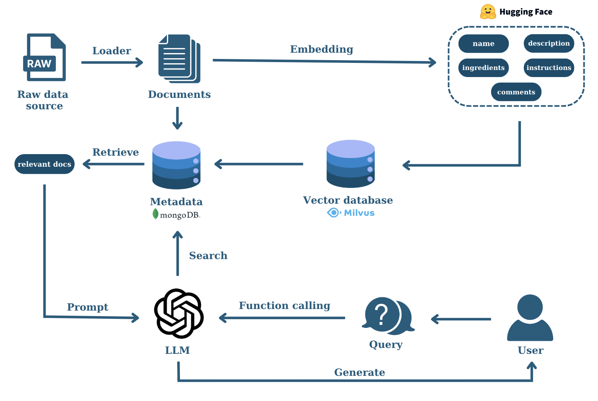

<h1>
  <p align="center">
    RAG Project
  </p>
</h1>

This repository contains the code and resources for the RAG project.




## Project Structure

The project is organized into the following folders:

- **data:** Contains datasets or data files used by the project.
- **docs:** Documentation for the project.
- **environments:** Contains the `Dockerfile` for creating developing environment.
- **notebooks:** Jupyter notebooks used for exploration, analysis, or testing.
- **scripts:** Contains scripts for various tasks (e.g., data preprocessing, model training).
- **services:** Contains scripts or configuration files related to services used by the project including: `Milvus`, and `MongoDB`. 
- **src:** Main code for this project

## Files

- **.env:** Environment variables file.
- **.gitignore:** Specifies files and directories to ignore for Git version control.
- **.pre-commit-config.yaml:** Configuration for pre-commit hooks.

## Getting Started

### Build and Push an image to Docker Hub

```bash
# Log in to Docker Hub
docker login

# Build the Docker image
cd environments
docker build -t miavox/rag:latest .

# Push the image to Docker Hub
docker push miavox/rag:latest
```

### Run the Docker Compose Services
Run the service container (open new terminal)
```
docker compose -f services/docker-compose.yml up
```

Verify the service network
```
docker network ls
docker network create services_milvus-network
```

```
docker run -it --name rag-container --network services_milvus-network --env-file .env -v $(pwd):/app miavox/rag /bin/bash
```

If environment you're running is not (team01)
```
conda activate team01
```

If you want to check that milvus-standalone connected to port
```
nc -zv milvus-standalone 19530
```

Finally, run the application:
```
bash ./scripts/test.sh
```

Run API:
```
uvicorn main:app --host 0.0.0.0 --port 8000
```

### Run dev container
Create `.env` file
```
## Milvus
MILVUS_SERVER_ADDR=milvus-standalone
MILVUS_SERVER_PORT=19530
MILVUS_COLLECTION_NAME=text_embeddings

## MongoDB
MONGO_SERVER_ADDR=milvus-mongodb:27017           
MONGO_DB_NAME=rag_cosmetic                    
MONGO_USRNAME=root                               
MONGO_PASSWD=root                                

## Collection Names
MONGO_PRODUCT_COLLECTION=product_collection_name
MONGO_SEARCH_RESULT_COLLECTION=search_result_collection

## OPENAI
OPENAI_API_KEY=sk-***

## Gemini
GEMINI_API_KEY=***
```